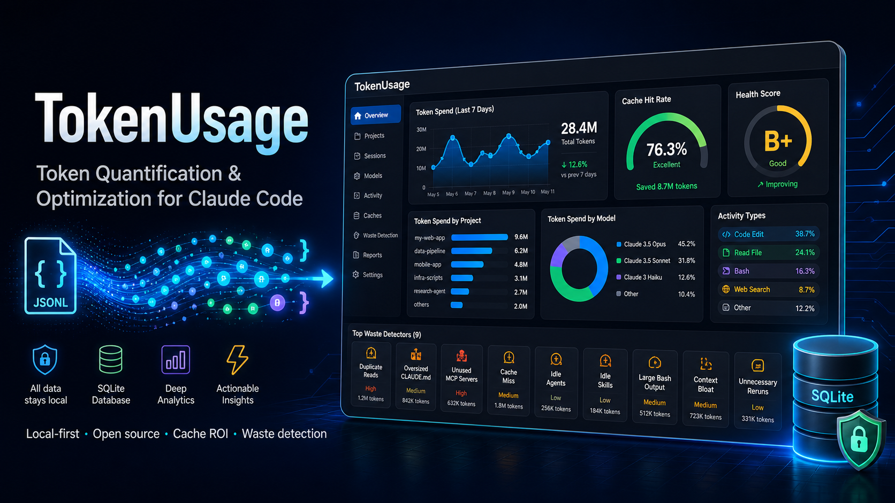

# TokenUsage

<p align="center">
  
</p>

<p align="center">
  <strong>Your Token Quantification & Optimization Command Center — Know exactly where every token goes, why it&#39;s spent, and how to spend less.</strong>
</p>

<p align="center">
  <a href="./LICENSE"></a>
  <a href="https://github.com/happy-token/TokenUsage/releases"></a>
  <a href="./CONTRIBUTING.md"></a>
</p>

<p align="center">
  English · <a href="./README_CN.md">中文</a>
</p>

---

## Links & Contact

| Channel | Account |
|---|---|
| Website | [happy-code.cn](https://happy-code.cn) |
| X / Twitter | [@HappyTokenAI](https://x.com/HappyTokenAI) |
| WeChat | HappyTokenAI |
| Telegram | [@HappyTokenAI](https://t.me/HappyTokenAI) |
| Feishu | HappyToken |
| Email domain | `@happy-token.cn` |

| WeChat QR | Feishu QR |
|---|---|
|  |  |

## Demo Video

[](./resources/promo/MainPromo.mp4)

[Watch the English demo video](./resources/promo/MainPromo.mp4)

TokenUsage is more than a token counter. It's a **token quantification tool** that reads your [Claude Code](https://claude.ai/code) session logs and answers three critical questions:

1. **Where are my tokens going?** — Per-project, per-model, per-activity-type breakdowns with granular session-level drill-down.
2. **What's wasting them?** — 9 automated waste detectors pinpoint redundant reads, oversized config files, unused MCP servers, and more — each with a one-click fix.
3. **How do I fix it?** — Actionable optimization guidance with health scores (A–F), cache ROI analysis, and copy-paste solutions.

All in a native Electron window. All data stays local.

## How It's Different

Most tools stop at "you spent $X this month." TokenUsage tells you **why** and **what to do about it**:

| What you learn | Why it matters |
|---|---|
| Cache hit rate per project / model / session | A low hit rate (common with relay/中转站 services) can inflate your real token cost by **10x** — see [Cache: The Silent Cost Multiplier](#-cache-the-silent-cost-multiplier) |
| Which activity type burns the most tokens | Debugging sessions often cost 5x more than feature work — and are fixable with better CLAUDE.md instructions |
| Health grade per project (A–F) | An "F" project with 35 findings isn't bad luck — it's a broken setup you can fix in 10 minutes |
| Read-to-edit ratio | Editing files without reading context first drives up retries and cost |
| Unused MCP servers / agents / skills | Each one silently adds ~2K tokens to every single session — even if never called |

## 📸 Screenshots

### Overview Dashboard

The overview is your command center — every module tells you something actionable about your token spend.

<p align="center">
  
</p>

#### ① KPI Strip (top row)
Four headline metrics at a glance: **Total Spend**, **Total Sessions**, **Cache Hit Rate** (weighted average across all projects), and **Active Projects** with the top project name. Each KPI has a color accent bar. The cache hit rate is the single most important number — if it's below 40%, scroll down to [Cache: The Silent Cost Multiplier](#-cache-the-silent-cost-multiplier).

#### ② Period Selector
Toggle between **Today**, **7 Days**, **30 Days**, and **All Time**. Every module on the page re-queries instantly.

#### ③ Daily Activity (bar chart)
Each bar = one day's total cost. Color gradient from teal (low) to orange to red (high). Hover for exact session count and cost. Below the chart, the last 6 days are listed as a table (date, sessions, cost).

#### ④ By Project
Top 8 projects ranked by cost, each with a proportional bar, session count, and dollar amount. Click any project to drill into its detail page.

#### ⑤ By Activity
Which activity types consume the most tokens? **Feature Dev**, **Debugging**, **Refactoring**, **Testing**, **Git Ops**, **Build/Deploy**, **Exploration**, **Planning**, **Brainstorming**, **Conversation** — each auto-classified from session behavior. Includes the **one-shot rate** (sessions where edits landed correctly on the first try — low rates mean wasted retries).

#### ⑥ By Model
Cost share per Claude model with per-model cache hit rate. Important: if one model shows an unusually low hit rate, check whether relay/中转站 routing is stripping cache headers for that specific model.

#### ⑦ Optimization Health (per-project grades)
Each project gets an A–F health grade with issue count and severity. A project with a "D" and 8 high-severity findings is likely hemorrhaging tokens on fixable problems. Click any project card to jump to its optimize panel.

#### ⑧ Token Breakdown + Cache ROI
Stacked bar showing Input / Output / Cache Read / Cache Write token distribution. Below it: **Cache Hit Rate**, **Gross Savings** (what cache saved you), **Write Cost** (what cache cost you), **Net ROI** (actual money in your pocket). Top 5 most expensive sessions are listed with project and cost.

#### ⑨ Top Tools + Shell Commands
Which tools Claude uses most (Read, Edit, Bash, Grep, Agent, etc.) and shell commands bucketed by category (git, build, test, file, network, process, other). This reveals over-reliance on expensive tool patterns.

#### ⑩ Aggregated Optimization Insights
Cross-project findings ranked by impact (high / medium / low). Each finding shows: title, how many projects are affected, which projects, and a **one-click copy fix** button. Common findings: reading `node_modules/`, re-reading the same files, oversized CLAUDE.md (>400 lines), unused MCP servers bloating every session.

---

### Project Detail: Token Quantification

The project view quantifies exactly where tokens go within a single project — session by session, model by model, tool by tool.

<p align="center">
  
</p>

#### ① Project KPIs
**Total Cost**, **Total Sessions**, **Cache Hit Rate**, **Average Cost per Session**. Same KPI strip pattern as the overview, scoped to one project.

#### ② Recent Sessions Table
Every session listed with: timestamp, cost, cache hit rate, model, duration, and delete action. The cache column is color-coded (teal = healthy >30%, yellow = borderline, muted = poor). This table is your session-level audit trail.

#### ③ Cost Analysis
Top 6 most expensive sessions with cost bars, total / average / session count summary. Identifies outlier sessions at a glance.

#### ④ Token Breakdown + Cache ROI
Identical layout to the overview module but scoped to this project. Stacked token bar (Input / Output / Cache Read / Cache Write) plus the cache gauge with gross savings, write cost, and net ROI.

#### ⑤ Activity Breakdown
Per-activity-type session counts with colored dots and bars. Includes **average retries** and **one-shot rate** KPIs. A project with high debugging activity and high retries is a strong signal that CLAUDE.md or project setup needs attention.

#### ⑥ Model Usage
Cost per model used in this project, with session count. Useful for identifying whether a project is over-using expensive models for simple tasks.

#### ⑦ Core Tools
Grid of top non-MCP tools with call counts (Read, Edit, Write, Bash, Grep, Glob, Agent, etc.). Reveals tool usage patterns — excessive Read without Edit may indicate exploration loops.

#### ⑧ Shell Command Categories
Shell usage broken down by category (git, build, test, file, etc.) with top 10 specific commands. Highlights whether Claude is running expensive or verbose commands.

#### ⑨ MCP Servers
Which MCP servers are actually being called and how often. Cross-reference this with the optimize panel's "unused MCP" finding — if a server appears here with zero count, it's wasting tokens on every session.

#### ⑩ Optimization Health Findings
Project-scoped waste detector results (same 9 detectors from the overview, but per-project). Each finding shows severity, title, explanation, and a one-click copy fix. The health grade updates in real time as you apply fixes.

---

## 💡 Cache: The Silent Cost Multiplier

### What is cache hit rate?

Claude's prompt cache remembers the system prompt, CLAUDE.md, and other static context across turns. When the cache **hits** (content was seen before), you pay **90% less** for those input tokens. When it **misses**, you pay full price.

### Why relay services (中转站) can cost you 10x more

When you use a relay/proxy service that pools free registered accounts:

- Each request may land on a **different underlying account** with no shared cache state.
- Claude sees each request as a **cold start** — the full system prompt, CLAUDE.md, MCP tool schemas, and agent definitions are re-uploaded every time.
- Your cache hit rate drops to **near 0%**.
- A session that would cost **$0.80** with direct API usage can balloon to **$8+** through a relay.

TokenUsage makes this invisible problem visible. If your overview dashboard shows a cache hit rate below 20%, and you're using a relay service, the math is straightforward:

| | Direct API (80% hit rate) | Relay/中转站 (0% hit rate) |
|---|---|---|
| Input tokens per session | 50K (10K new + 40K cached) | 50K (all new) |
| Input cost per session | ~$0.05 | ~$0.15 |
| Cache-read savings | ~$0.12 | $0.00 |
| **Effective cost multiplier** | **1x** | **~3–10x depending on session length** |

> The longer your sessions and the larger your CLAUDE.md, the more dramatic the gap. A project with a 400-line CLAUDE.md, 5 MCP servers, and 10 custom agents through a relay service is burning ~15K–20K tokens on every single cold start. TokenUsage detects this and tells you exactly what to trim.

## ✨ Features

- **Overview Dashboard** — KPI strip (total spend, sessions, cache hit rate, active projects) with daily activity bars and per-project cost bars
- **Project Drill-Down** — per-session timeline, activity type breakdown (feature, debugging, refactoring, testing, git, build-deploy, exploration, planning, brainstorming, conversation), model usage, git branch tracking
- **Optimization Health Score** — per-project health grade (A–F) with actionable waste findings and one-click fix copy, covering 9 waste detectors:
  1. Reading junk directories (`node_modules/`, `.git/`, `dist/`)
  2. Re-reading the same files across turns
  3. Editing without reading context first (low read:edit ratio)
  4. Session warmup too large (oversized CLAUDE.md / MCP schemas / agents)
  5. Bash commands with un-piped large output
  6. CLAUDE.md exceeding 200 lines
  7. Custom agents defined but never invoked
  8. Skills installed but never used
  9. MCP servers configured but never called
- **Cache ROI** — gross savings, write cost, and net ROI from Claude's prompt cache
- **Tool & Shell Stats** — top tools used and shell commands by category
- **Session Activity Classification** — auto-classifies each session into 10 activity types
- **System Tray** — live today's cost and 7-day stats without opening the main window
- **i18n** — English / 中文 toggle
- **Theme** — dark / light with persistent preference

## 🚀 Tech Stack

| Layer | Technology |
|---|---|
| Shell | Electron 30 |
| Renderer | React 18 + TypeScript |
| Build | electron-vite + Vite 5 |
| Storage | better-sqlite3 (local, no server) |
| File watch | chokidar |
| Packaging | electron-builder |

## 📋 Requirements

- **Node.js** 20+
- **pnpm** 9+
- **macOS** (primary target), Windows, or Linux

## ⚡ Getting Started

```bash
# Clone the repo
git clone https://github.com/happy-token/TokenUsage.git
cd TokenUsage

# Install dependencies (also compiles native SQLite addon)
pnpm install

# Start in development mode
pnpm run dev
```

The app automatically discovers Claude Code session logs at `~/.claude/projects/**/*.jsonl` and begins parsing them. No configuration required.

## 📦 Installation

Download the latest release from the [Releases](https://github.com/happy-token/TokenUsage/releases) page:

| Platform | Package |
|---|---|
| **macOS** | `.dmg` |
| **Windows** | `.exe` (NSIS installer) |
| **Linux** | `.AppImage` |

## 📖 Scripts

| Command | Description |
|---|---|
| `pnpm run dev` | Start Electron + Vite dev server with HMR |
| `pnpm run build` | Production build |
| `pnpm run package` | Build + package distributable (`.dmg`, `.exe`, `.AppImage`) |
| `pnpm test` | Run unit tests (Vitest) |
| `pnpm run test:watch` | Watch mode |
| `pnpm run test:e2e` | Playwright end-to-end tests |
| `pnpm run typecheck` | TypeScript type check without emitting |
| `pnpm run sync-models` | Sync model pricing from [models.dev](https://github.com/anomalyco/models.dev) |

## 📁 Project Structure

```
TokenUsage/
├── src/
│   ├── main/            # Electron main process
│   │   ├── index.ts     # App bootstrap, window, system tray
│   │   ├── db.ts        # SQLite schema & migrations
│   │   ├── parser.ts    # JSONL → session/turn model + cost calc
│   │   ├── watcher.ts   # chokidar file watcher
│   │   ├── classifier.ts  # Activity type classification
│   │   ├── optimize.ts  # Health scoring & waste findings
│   │   ├── ipc.ts       # IPC handler registry
│   │   └── store.ts     # Query & tray stats cache
│   ├── preload/
│   │   └── index.ts     # Context bridge (exposes window.tokenUsage)
│   └── renderer/
│       └── src/
│           ├── App.tsx          # Root component + routing
│           ├── pages/           # Overview, ProjectDetail, Settings, Sessions
│           ├── components/      # Sidebar, AppLogo
│           ├── contexts/        # ThemeContext, I18nContext
│           └── types.ts         # Renderer-side shared types
├── tests/                # Unit tests + JSONL fixtures
├── resources/            # Icons, models.json pricing table, screenshots
├── scripts/              # Build, notarization, release helpers
└── .github/workflows/    # CI + release pipelines
```

## 💰 Model Pricing

Cost is computed locally from token counts using official pricing rates (USD per 1M tokens). Pricing data is sourced from [models.dev](https://github.com/anomalyco/models.dev) — a community-maintained, open-source model registry covering 100+ providers.

**Supported providers:** Anthropic, OpenAI, Google Gemini, DeepSeek, xAI (Grok), Mistral, Groq, Cerebras, and more. Run `pnpm run sync-models` to pull the latest pricing from models.dev.

### Popular models

| Model | Input | Output | Cache Read | Cache Write |
|---|---|---|---|---|
| claude-opus-4-7 | $5.00 | $25.00 | $0.50 | $6.25 |
| claude-sonnet-4-6 | $3.00 | $15.00 | $0.30 | $3.75 |
| claude-haiku-4-5 | $1.00 | $5.00 | $0.10 | $1.25 |
| gpt-4.1 | $2.00 | $8.00 | $0.50 | $2.50 |
| gpt-4o | $2.50 | $10.00 | $1.25 | $2.50 |
| gpt-4.1-mini | $0.40 | $1.60 | $0.10 | $0.50 |
| gemini-2.5-pro | $1.25 | $10.00 | $0.25 | — |
| gemini-2.5-flash | $0.15 | $0.60 | $0.06 | — |
| deepseek-chat (V3) | $0.27 | $1.10 | $0.07 | $0.14 |
| deepseek-reasoner (R1) | $0.55 | $2.19 | $0.14 | $0.55 |

> Full pricing (171 models) is in `resources/models.json`. To update: `pnpm run sync-models`. To add specific providers: `pnpm run sync-models openai google`. To sync all 100+ providers: `pnpm run sync-models --all`. If a session already includes a `costUSD` field in the JSONL, that value is used directly.

## 🔒 Data & Privacy

**All data stays on your machine.** Nothing is sent to any server. The SQLite database is stored in Electron's [app data directory](https://www.electronjs.org/docs/latest/api/app#appgetpathname). No telemetry, no tracking, no analytics — just local files.

## 🙋 FAQ

<details>
<summary><strong>How does TokenUsage get my Claude Code data?</strong></summary>
<br />
Claude Code writes session logs as <code>.jsonl</code> files in <code>~/.claude/projects/</code>. TokenUsage watches this directory, parses new entries, and stores them in a local SQLite database. The data never leaves your machine.
</details>

<details>
<summary><strong>Do I need an internet connection?</strong></summary>
<br />
No. TokenUsage works entirely offline. Only the model pricing in <code>resources/models.json</code> is bundled statically — you can update it manually if pricing changes.
</details>

<details>
<summary><strong>How accurate is the cost tracking?</strong></summary>
<br />
TokenUsage uses two strategies: (1) if Claude Code includes a <code>costUSD</code> field, that value is used directly; (2) otherwise, cost is computed locally from token counts using the official Anthropic pricing rates. Cache write costs and read savings are also factored in.
</details>

<details>
<summary><strong>How does the health score work?</strong></summary>
<br />
The optimization engine runs 9 waste detectors (e.g., reading <code>node_modules/</code>, duplicate file reads, oversized CLAUDE.md). Each finding impacts the score based on severity (high: -15, medium: -7, low: -3). Grade: A (90+), B (75+), C (55+), D (30+), F (<30). Results are cached for 1 hour.
</details>

<details>
<summary><strong>Why is my cache hit rate so low?</strong></summary>
<br />
Common causes: (1) using a relay/中转站 service that routes requests across different accounts with no shared cache state; (2) very short sessions that don't benefit from caching; (3) frequently changing CLAUDE.md or MCP configurations between sessions. Direct API usage typically sees 40–90% hit rates. Relay services often see 0–20%.
</details>

<details>
<summary><strong>Can I contribute pricing for a new model?</strong></summary>
<br />
Yes! See <a href="./CONTRIBUTING.md#adding-a-new-model">CONTRIBUTING.md</a>. Add a new entry to <code>resources/models.json</code> with the canonical model ID and per-token pricing, then submit a PR.
</details>

<details>
<summary><strong>Can I delete sessions or projects from the app?</strong></summary>
<br />
Yes. You can delete individual sessions from the project detail view, and entire projects (with all their sessions) are also deletable. Note: this only removes data from the TokenUsage database — your original <code>.jsonl</code> files are untouched.
</details>

<details>
<summary><strong>Which platforms are supported?</strong></summary>
<br />
macOS (Intel + Apple Silicon), Windows (x64), and Linux (x64 AppImage). macOS is the primary development target.
</details>

<details>
<summary><strong>Does TokenUsage work with the Claude API directly?</strong></summary>
<br />
No — TokenUsage is designed specifically for Claude Code's session logs. For direct API usage, your API dashboard on console.anthropic.com provides cost analytics.
</details>

## 🗺 Roadmap

See [ROADMAP.md](./ROADMAP.md) for the full project roadmap, including planned features and long-term goals.

## 👥 Community & Support

We'd love to hear from you! Here's how to connect:

| Channel | Link | Best For |
|---|---|---|
| **GitHub Issues** | [Issues](https://github.com/happy-token/TokenUsage/issues) | Bug reports, feature requests |
| **GitHub Discussions** | [Discussions](https://github.com/happy-token/TokenUsage/discussions) | Q&A, ideas, community chat |
| **Discord** | _Coming soon_ | Real-time chat, developer collaboration |
| **Telegram** | _Coming soon_ | Community updates, quick questions |
| **WeChat (微信)** | _Coming soon_ | Chinese-speaking user community |

> **Community platform recommendation:** Discord is the standard for international developer tools (think VS Code, Electron, React communities). Telegram is very popular in Asia, Eastern Europe, and the crypto/tech crowd. WeChat is essential for the Chinese developer ecosystem. We recommend joining whichever platform you're most comfortable with — we'll share announcements across all channels.

## 🤝 Contributing

We welcome contributions! See [CONTRIBUTING.md](./CONTRIBUTING.md) for:

- Development setup
- How to add new models
- Pull request guidelines
- Code review expectations

This project follows the [Contributor Covenant Code of Conduct](./CODE_OF_CONDUCT.md).

## 📄 License

MIT © [happy-token](https://github.com/happy-token)

---

<p align="center">
  <sub>Built with ❤️ for the Claude Code community. If you find TokenUsage useful, please consider <a href="https://github.com/happy-token/TokenUsage">giving it a star ⭐</a> on GitHub!</sub>
</p>
