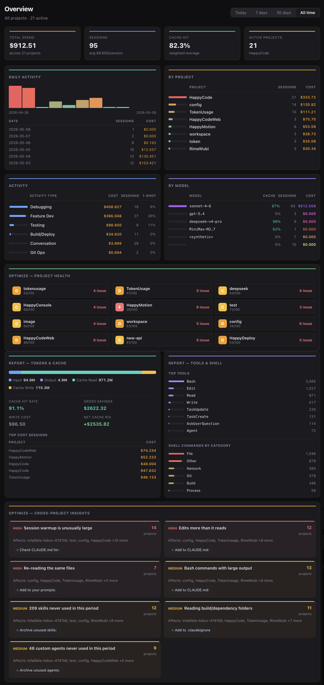
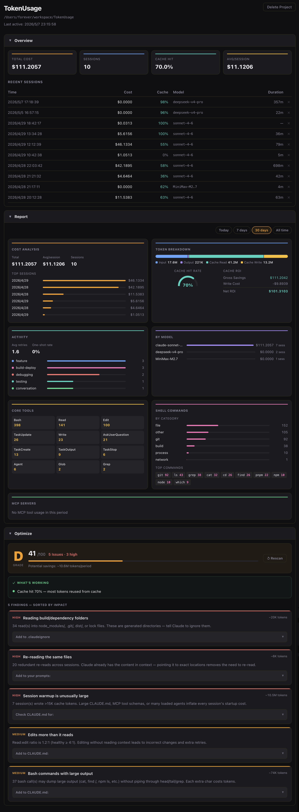

# TokenUsage

<p align="center">
  <strong>你的 Token 量化与优化指挥中心 — 精准知道每个 Token 花在哪里、为什么花、如何花得更少。</strong>
</p>

<p align="center">
  <a href="./LICENSE"></a>
  <a href="https://github.com/happy-token/TokenUsage/releases"></a>
  <a href="./CONTRIBUTING.md"></a>
</p>

<p align="center">
  <a href="./README.md">English</a> · 中文
</p>

---

TokenUsage 不止是 Token 统计工具，更是一套 **Token 量化分析系统**，读取 [Claude Code](https://claude.ai/code) 本地会话日志，回答三个核心问题：

1. **Token 花在哪里？** — 按项目、按模型、按活动类型逐层下钻，精确定位每一笔 Token 开销。
2. **哪些在浪费？** — 9 种自动浪费检测器，精准发现重复读取、冗余配置文件、闲置 MCP 服务器等问题，每个都有修复建议。
3. **怎么省？** — 可操作的优化指导，包含健康评分（A–F）、缓存 ROI 分析和一键复制修复方案。

全部在原生 Electron 窗口中呈现，数据完全保留在本地。

## 不只是统计，是量化

大多数工具只能告诉你"这个月花了 X 美元"。TokenUsage 告诉你**为什么**以及**怎么办**：

| 你能知道什么 | 为什么重要 |
|---|---|
| 每个项目 / 模型 / 会话的缓存命中率 | 命中率低（中转站常见）会让实际 Token 成本**膨胀 10 倍** — 详见[缓存：沉默的成本放大器](#-缓存沉默的成本放大器) |
| 哪种活动类型烧 Token 最多 | 调试会话的成本通常是功能开发的 5 倍 — 优化 CLAUDE.md 指令即可改善 |
| 每个项目的健康等级（A–F） | 一个 "F" 级、35 条问题的项目不是运气差 — 是配置有问题，10 分钟就能修好 |
| 读取-编辑比 | 不读代码直接编辑会导致大量返工和重试 |
| 闲置的 MCP 服务器 / Agent / Skill | 每个都会在每次会话中悄悄加载 ~2K Token — 即使从未调用 |

## 📸 截图

### 总览仪表盘

总览是你的指挥中心 — 每个模块都在告诉你关于 Token 消耗的具体信息。

<p align="center">
  
</p>

#### ① KPI 指标条（顶部）
四项核心指标一目了然：**总花费**、**总会话数**、**缓存命中率**（所有项目的加权平均）、**活跃项目数**（附用量最高的项目名）。每个 KPI 都有颜色标识。缓存命中率是最关键的数字——如果低于 40%，请往下看[缓存：沉默的成本放大器](#-缓存沉默的成本放大器)。

#### ② 时间范围选择器
在**今天**、**7 天**、**30 天**和**全部**之间切换。页面上所有模块即时重新查询。

#### ③ 每日活动（柱状图）
每根柱子 = 一天的 Token 花费。颜色渐变从青（低）到橙到红（高）。悬停可查看具体会话数和花费。图表下方以表格形式列出最近 6 天（日期、会话数、花费）。

#### ④ 按项目分布
按花费排序的前 8 个项目，每个都有比例条、会话数和金额。点击任意项目进入详情页。

#### ⑤ 按活动类型分布
哪些活动类型消耗 Token 最多？**功能开发**、**调试**、**重构**、**测试**、**Git 操作**、**构建部署**、**探索**、**规划**、**头脑风暴**、**对话** — 每种都根据会话行为自动分类。包含 **一次成功率**（编辑一次就正确的会话比例 — 低成功率意味着大量浪费的返工）。

#### ⑥ 按模型分布
各 Claude 模型的成本占比及每个模型的缓存命中率。重要提示：如果某个模型命中率异常低，检查是否中转站对该模型剥离了缓存 header。

#### ⑦ 优化健康评分（项目等级）
每个项目获得 A–F 健康等级，附带问题数量和严重程度。一个 "D" 级、8 个高严重性问题的项目很可能在可以修复的问题上大量浪费 Token。点击任意项目卡片跳转到其优化面板。

#### ⑧ Token 构成 + 缓存 ROI
堆叠条形图展示 Input / Output / Cache Read / Cache Write 的 Token 分布。下方显示：**缓存命中率**、**节省总额**（缓存帮你省了多少）、**写入成本**（缓存花了你多少）、**净收益**（实际省下的钱）。列出花费最高的 5 个会话。

#### ⑨ 常用工具 + Shell 命令
Claude 最常用的工具（Read、Edit、Bash、Grep、Agent 等）以及按类别（git、build、test、file、network、process、other）分类的 Shell 命令。这里能反映出是否过度依赖某些高成本的工具模式。

#### ⑩ 聚合优化洞察
跨项目的问题汇总，按影响程度（高 / 中 / 低）排序。每个问题显示：标题、影响项目数、具体项目名、**一键复制修复方案**按钮。常见问题：读取 `node_modules/`、重复读取相同文件、CLAUDE.md 过大（>400 行）、闲置的 MCP 服务器在每次会话中浪费 Token。

---

### 项目详情：Token 量化

项目视图精确量化单个项目内的 Token 去向 — 按会话、按模型、按工具。

<p align="center">
  
</p>

#### ① 项目 KPI
**总花费**、**总会话数**、**缓存命中率**、**平均每次会话花费**。与总览相同的 KPI 模式，范围限定到单个项目。

#### ② 最近会话表格
每个会话列出：时间戳、花费、缓存命中率、模型、耗时、删除操作。缓存列颜色编码（青色 = 健康 >30%、黄色 = 临界、灰色 = 较差）。这个表格是你的会话级审计追踪。

#### ③ 成本分析
花费最高的 6 个会话及其成本条，附总计 / 平均 / 会话数摘要。一眼识别异常高花费会话。

#### ④ Token 构成 + 缓存 ROI
与总览模块布局一致，限定到当前项目。堆叠 Token 条形图 + 缓存仪表盘，包含节省总额、写入成本、净收益。

#### ⑤ 活动类型分布
各活动类型的会话数，带彩色圆点和比例条。包含**平均重试次数**和**一次成功率** KPI。调试活动多、重试次数高的项目强烈暗示 CLAUDE.md 或项目配置需要优化。

#### ⑥ 模型使用情况
该项目使用的各模型成本及会话数。有助于发现是否在简单任务上过度使用昂贵模型。

#### ⑦ 核心工具
非 MCP 工具的调用次数网格（Read、Edit、Write、Bash、Grep、Glob、Agent 等）。大量 Read 但很少 Edit 可能意味着探索性循环过多。

#### ⑧ Shell 命令分类
按类别（git、build、test、file 等）分解 Shell 使用情况，附前 10 具体命令。暴露 Claude 是否在运行昂贵或输出量大的命令。

#### ⑨ MCP 服务器
哪些 MCP 服务器被实际调用及调用频率。与优化面板的"未使用 MCP"问题交叉对比 — 如果某个服务器在此处计数为零，说明它在每个会话中都在浪费 Token。

#### ⑩ 优化健康问题
项目范围的浪费检测结果（与总览相同的 9 种检测器，但按项目展示）。每个问题显示严重程度、标题、解释和修复建议。健康等级随应用修复实时更新。

---

## 💡 缓存：沉默的成本放大器

### 什么是缓存命中率？

Claude 的提示缓存会记住系统提示词、CLAUDE.md 和其他静态上下文。当缓存**命中**时（内容之前见过），这部分输入 Token 享受 **90% 的折扣**。当缓存**未命中**时，需支付全价。

### 为什么中转站会让你的成本膨胀 10 倍

使用中转站/注册机免费额度时：

- 每次请求可能落在**不同的底层账号**上，缓存状态不共享。
- Claude 将每次请求视为**冷启动** — 完整的系统提示词、CLAUDE.md、MCP 工具 Schema、Agent 定义每次都重新上传。
- 缓存命中率降至**接近 0%**。
- 直接 API 花费 **$0.80** 的会话，走中转站可能膨胀到 **$8+**。

TokenUsage 将这个隐形问题变得可见。如果你总览面板的缓存命中率低于 20%，而且你在用中转站，数学很简单：

| | 直接 API（80% 命中率）| 中转站（0% 命中率）|
|---|---|---|
| 每次会话输入 Token | 50K（10K 新增 + 40K 缓存）| 50K（全部新增）|
| 每次会话输入成本 | ~$0.05 | ~$0.15 |
| 缓存读取节省 | ~$0.12 | $0.00 |
| **实际成本倍数** | **1x** | **约 3–10 倍，取决于会话长度** |

> 会话越长、CLAUDE.md 越大，差距越惊人。一个拥有 400 行 CLAUDE.md、5 个 MCP 服务器、10 个自定义 Agent 的项目通过中转站使用时，每次冷启动都会烧掉约 15K–20K Token。TokenUsage 会检测到这个问题并告诉你具体该削减什么。

## ✨ 功能特性

- **总览仪表盘** — 总花费、会话数、缓存命中率、活跃项目四项 KPI，按天、按项目的消耗柱状图
- **项目详情** — 会话时间线、活动类型分布（功能开发 / 调试 / 重构 / 测试 / Git / 构建部署 / 探索 / 规划 / 头脑风暴 / 对话）、模型使用情况、Git 分支追踪
- **优化健康评分** — 每个项目 A–F 等级评分，配备 9 种浪费检测器，一键复制修复建议：
  1. 读取无用目录（`node_modules/`、`.git/`、`dist/`）
  2. 跨轮次重复读取相同文件
  3. 不读代码直接编辑（读取-编辑比过低）
  4. 会话预热过大（CLAUDE.md / MCP Schema / Agent 过多）
  5. Bash 命令输出未截断
  6. CLAUDE.md 超过 200 行
  7. 自定义 Agent 从未使用
  8. 安装的 Skill 从未调用
  9. MCP 服务器配置但从未使用
- **缓存 ROI** — 缓存节省金额、写入成本、净收益一览
- **工具 & Shell 统计** — 最常用工具排行和 Shell 命令分类
- **会话活动分类** — 自动将每个会话归类为 10 种活动类型
- **系统托盘** — 无需打开主窗口，实时查看今日花费和近 7 天统计
- **中英双语** — 界面支持 English / 中文切换
- **深色/浅色主题** — 偏好设置自动持久化

## 🚀 技术栈

| 层级 | 技术 |
|---|---|
| 壳层 | Electron 30 |
| 渲染层 | React 18 + TypeScript |
| 构建 | electron-vite + Vite 5 |
| 存储 | better-sqlite3（纯本地，无服务器）|
| 文件监听 | chokidar |
| 打包 | electron-builder |

## 📋 环境要求

- **Node.js** 20+
- **pnpm** 9+
- **macOS**（主要平台）、Windows 或 Linux

## ⚡ 快速开始

```bash
# 克隆仓库
git clone https://github.com/happy-token/TokenUsage.git
cd TokenUsage

# 安装依赖（同时编译原生 SQLite 插件）
pnpm install

# 开发模式启动
pnpm run dev
```

应用会自动扫描 `~/.claude/projects/**/*.jsonl`，无需任何配置即可看到数据。

## 📦 安装

前往 [Releases](https://github.com/happy-token/TokenUsage/releases) 页面下载最新版本：

| 平台 | 安装包 |
|---|---|
| **macOS** | `.dmg` |
| **Windows** | `.exe`（NSIS 安装包）|
| **Linux** | `.AppImage` |

## 📖 常用命令

| 命令 | 说明 |
|---|---|
| `pnpm run dev` | 启动 Electron + Vite 开发服务器（支持热更新）|
| `pnpm run build` | 生产环境构建 |
| `pnpm run package` | 构建并打包发行版（`.dmg` / `.exe` / `.AppImage`）|
| `pnpm test` | 运行单元测试（Vitest）|
| `pnpm run test:watch` | 测试监听模式 |
| `pnpm run test:e2e` | Playwright 端到端测试 |
| `pnpm run typecheck` | TypeScript 类型检查 |

## 📁 项目结构

```
TokenUsage/
├── src/
│   ├── main/            # Electron 主进程
│   │   ├── index.ts     # 应用启动、窗口、系统托盘
│   │   ├── db.ts        # SQLite Schema 与迁移
│   │   ├── parser.ts    # JSONL → 会话/轮次模型 + 费用计算
│   │   ├── watcher.ts   # chokidar 文件监听
│   │   ├── classifier.ts  # 活动类型分类
│   │   ├── optimize.ts  # 健康评分与浪费发现
│   │   ├── ipc.ts       # IPC 处理器注册
│   │   └── store.ts     # 数据查询与托盘统计缓存
│   ├── preload/
│   │   └── index.ts     # Context Bridge（暴露 window.tokenUsage）
│   └── renderer/
│       └── src/
│           ├── App.tsx          # 根组件 + 路由
│           ├── pages/           # Overview, ProjectDetail, Settings, Sessions
│           ├── components/      # Sidebar, AppLogo
│           ├── contexts/        # ThemeContext, I18nContext
│           └── types.ts         # 渲染层共享类型
├── tests/                # 单元测试 + JSONL 测试固件
├── resources/            # 图标、models.json 定价表、截图
├── scripts/              # 构建、公证、发布脚本
└── .github/workflows/    # CI + 发布流水线
```

## 💰 模型定价

费用根据 Token 数量在本地计算，使用以下标准（美元 / 百万 Token）：

| 模型 | 输入 | 输出 | 缓存读取 | 缓存写入 |
|---|---|---|---|---|
| claude-opus-4-7 / 4-6 | $15 | $75 | $1.5 | $18.75 |
| claude-sonnet-4-6 | $3 | $15 | $0.3 | $3.75 |
| claude-haiku-4-5 | $0.8 | $4 | $0.08 | $1.00 |

若 JSONL 中已包含 `costUSD` 字段，则直接使用该值。模型定价配置在 `resources/models.json` 中。

## 🔒 数据与隐私

**所有数据保留在本地。** 不会发送到任何服务器。SQLite 数据库存储在 Electron 的[应用数据目录](https://www.electronjs.org/docs/latest/api/app#appgetpathname)中。无遥测、无追踪、无分析——只有本地文件。

## 🙋 常见问题

<details>
<summary><strong>TokenUsage 如何获取我的 Claude Code 数据？</strong></summary>
<br />
Claude Code 在 <code>~/.claude/projects/</code> 目录下写入 JSONL 会话日志。TokenUsage 监听此目录，解析新条目并存储在本地 SQLite 数据库中。数据绝不会离开你的机器。
</details>

<details>
<summary><strong>需要联网吗？</strong></summary>
<br />
不需要。TokenUsage 完全离线运行。只有 <code>resources/models.json</code> 中的模型定价是静态打包的——如果定价变动，你可以手动更新。
</details>

<details>
<summary><strong>费用追踪有多准确？</strong></summary>
<br />
TokenUsage 使用双重策略：(1) 若 Claude Code 在 JSONL 中包含了 <code>costUSD</code> 字段，则直接使用该值；(2) 否则，根据 Token 数量使用 Anthropic 官方定价在本地计算。缓存写入成本和读取节省也会一并计入。
</details>

<details>
<summary><strong>健康评分是如何计算的？</strong></summary>
<br />
优化引擎运行 9 种浪费检测器（例如：读取 <code>node_modules/</code>、重复文件读取、过大的 CLAUDE.md）。每个发现根据严重程度影响评分（高：-15、中：-7、低：-3）。等级：A (90+)、B (75+)、C (55+)、D (30+)、F (<30)。结果缓存 1 小时。
</details>

<details>
<summary><strong>为什么我的缓存命中率这么低？</strong></summary>
<br />
常见原因：(1) 使用中转站/注册机服务，请求被路由到不同底层账号，缓存状态无法共享；(2) 会话太短，达不到缓存生效的阈值；(3) 在不同会话之间频繁修改 CLAUDE.md 或 MCP 配置。直接 API 使用通常能看到 40–90% 的命中率，中转站通常只有 0–20%。
</details>

<details>
<summary><strong>我能否为新的模型贡献定价？</strong></summary>
<br />
可以！请参见 <a href="./CONTRIBUTING.md#adding-a-new-model">CONTRIBUTING.md</a>。在 <code>resources/models.json</code> 中添加带有规范模型 ID 和单 Token 定价的新条目，然后提交 PR。
</details>

<details>
<summary><strong>可以从应用中删除会话或项目吗？</strong></summary>
<br />
可以。你可以在项目详情中删除单个会话，也可以删除整个项目（及所有会话）。注意：这只会从 TokenUsage 数据库中删除数据——原始 <code>.jsonl</code> 文件不会受影响。
</details>

<details>
<summary><strong>支持哪些平台？</strong></summary>
<br />
macOS（Intel + Apple Silicon）、Windows（x64）、Linux（x64 AppImage）。macOS 是主要开发平台。
</details>

<details>
<summary><strong>TokenUsage 能否直接配合 Claude API 使用？</strong></summary>
<br />
不能——TokenUsage 专为 Claude Code 的会话日志设计。如需直接使用 API 的费用分析，console.anthropic.com 上的 API 控制台已提供相关功能。
</details>

## 🗺 路线图

详见 [ROADMAP.md](./ROADMAP.md)，包含计划功能与长期目标。

## 👥 社区与支持

期待你的加入！以下是沟通渠道：

| 渠道 | 链接 | 适用场景 |
|---|---|---|
| **GitHub Issues** | [Issues](https://github.com/happy-token/TokenUsage/issues) | Bug 报告、功能请求 |
| **GitHub Discussions** | [Discussions](https://github.com/happy-token/TokenUsage/discussions) | 问答、想法交流、社区讨论 |
| **Discord** | _即将上线_ | 实时聊天、开发者协作 |
| **Telegram** | _即将上线_ | 社区更新、快速问答 |
| **微信交流群** | _即将上线_ | 中文用户社区 |

> **社区平台建议：** Discord 是国际开发者社区的主流平台（VS Code、Electron、React 等社区均在使用）。Telegram 在亚洲、东欧和开发者圈子中非常流行。微信群对中文开发者生态至关重要。建议选择你最习惯的平台加入——我们会在所有渠道同步重要公告。

## 🤝 贡献

欢迎贡献！详见 [CONTRIBUTING.md](./CONTRIBUTING.md)：

- 开发环境搭建
- 如何添加新模型
- Pull Request 指南
- 代码审查标准

本项目遵循 [Contributor Covenant 行为准则](./CODE_OF_CONDUCT.md)。

## 📄 许可证

MIT © [happy-token](https://github.com/happy-token)

---

<p align="center">
  <sub>为 Claude Code 社区倾心打造。如果 TokenUsage 对你有帮助，欢迎在 <a href="https://github.com/happy-token/TokenUsage">GitHub 上给个 ⭐ Star</a>！</sub>
</p>
